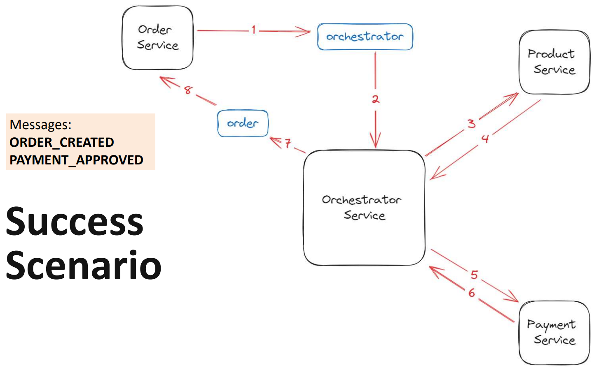
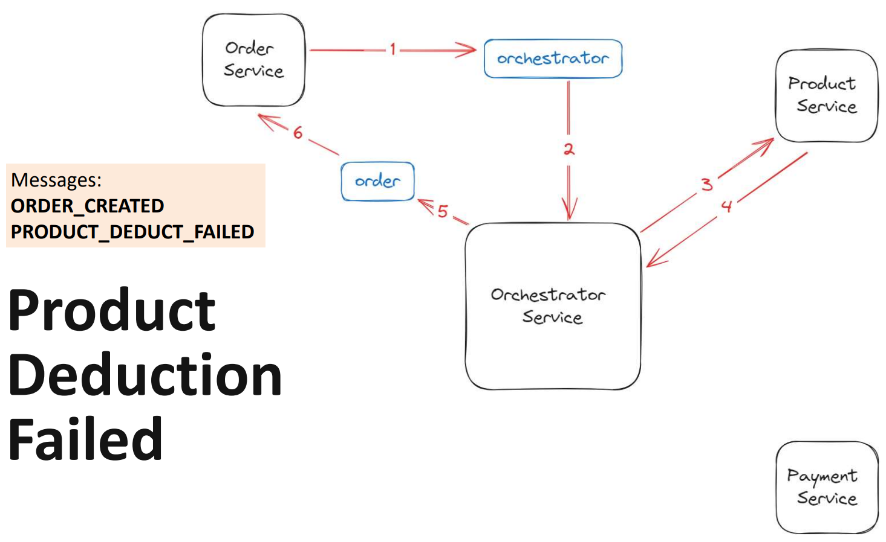
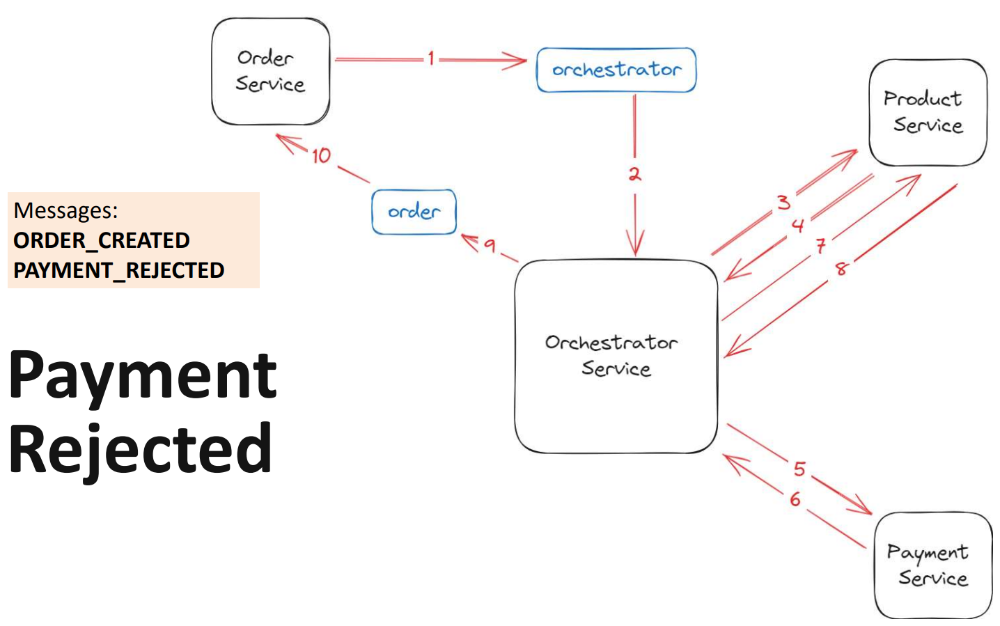

<div align="center">
  <br>
  <h1>Phincommerce</h1>
  <p>🛒 A simple ecommerce REST API to help people buy products online 🛒</p>
  <br>
</div>

## Table of Contents

- [Description](#description)
- [API Docs](#api-docs)
- [Minimum Requirements](#minimum-requirements)
- [Tech Stack](#tech-stack)
- [Run Locally](#run-locally)

## Description

[`^ back to top ^`](#table-of-contents)

**Phincommerce** is a reactive REST API that implements microservice architecture to help
people buy products online. It is created for the final project in the Java phase of the Backend Development Training.

## API Docs

[`^ back to top ^`](#table-of-contents)

- Product Service: [localhost:8081/api/v1/docs](http://localhost:8081/api/v1/docs)
- Order Service: [localhost:8082/api/v1/docs](http://localhost:8082/api/v1/docs)
- Payment Service: [localhost:8083/api/v1/docs](http://localhost:8083/api/v1/docs)

## Minimum Requirements

[`^ back to top ^`](#table-of-contents)

- Add a new order.
- Display list of orders.
- Update order status (created, completed, or failed).
- Update product quantity (deduct or add).
- Add a transaction detail (approved or rejected).
- Update balance amount (debit or credit).







## Tech Stack

[`^ back to top ^`](#table-of-contents)

- [Spring Reactive Web](https://mvnrepository.com/artifact/org.springframework.boot/spring-boot-starter-webflux)
- [R2DBC](https://r2dbc.io)
- [Hibernate Validator](https://hibernate.org/validator)
- [PostgreSQL](https://www.postgresql.org)
- [Kafka](https://kafka.apache.org)
- [springdoc-openapi](https://springdoc.org)

## Run Locally

[`^ back to top ^`](#table-of-contents)

- Make sure you have [Java](https://www.oracle.com/java), [PostgreSQL](https://www.postgresql.org), & [Kafka](https://kafka.apache.org) installed on your computer.
- Connect to the PostgreSQL server by providing a user name & password.

  ```bash
  psql -U postgres
  ```

  Then create databases for product service, order service, & payment service. You can name it as `phincommerce_product`, `phincommerce_order`, & `phincommerce_payment`.

  ```bash
  CREATE DATABASE phincommerce_product;
  ```

  ```bash
  CREATE DATABASE phincommerce_order;
  ```

  ```bash
  CREATE DATABASE phincommerce_payment;
  ```

- Clone the repo.

  ```bash
  git clone https://github.com/nadiannis/phincommerce.git
  ```

  ```bash
  cd phincommerce
  ```

- Run the zookeeper server & Kafka broker.

  ```bash
  cd kafka
  ```

  ```bash
  ./bin/zookeeper-server-start.sh ./config/zookeeper.properties
  ```

  ```bash
  ./bin/kafka-server-start.sh ./config/server.properties
  ```

- Connect each service to its respective database by writing the information about the database you use in the `application.properties` file.

  ```
  # example

  spring.r2dbc.url=r2dbc:postgresql://localhost:5432/phincommerce_order
  spring.r2dbc.username=postgres
  spring.r2dbc.password=pass1234
  spring.r2dbc.driver-class-name=org.postgresql.Driver
  ```

- Add Kafka config to `application.properties` in the [order-service](./order-service/src/main/resources/application.properties) & [orchestrator-service](./orchestrator-service/src/main/resources/application.properties).

  ```
  # Kafka producer
  spring.kafka.producer.bootstrap-servers=localhost:9092
  spring.kafka.producer.key-serializer=org.apache.kafka.common.serialization.StringSerializer
  spring.kafka.producer.value-serializer=org.springframework.kafka.support.serializer.JsonSerializer

  # Kafka consumer
  spring.kafka.consumer.bootstrap-servers=localhost:9092
  spring.kafka.consumer.group-id=phincommerce
  spring.kafka.consumer.key-deserializer=org.apache.kafka.common.serialization.StringDeserializer
  spring.kafka.consumer.value-deserializer=org.apache.kafka.common.serialization.StringDeserializer
  spring.kafka.consumer.properties.spring.json.trusted.packages=*
  ```

- Install the [common](./common) project.

  ```bash
  cd ./common
  ```

  ```bash
  ./mvnw clean install
  ```

- Run the orchestrator service first. The Kafka topics needed will be created. The web server will run on port `8080`.

- Then run other services. The product service will run on port `8081`, order service will run on port `8082`, & payment service will run on port `8083`.
